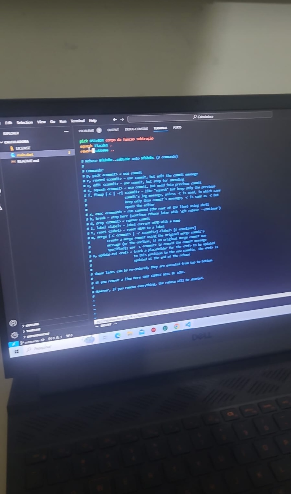

# calculadora
praticar os comandos do **git em bash (git rebase)**, e algoritmo em dart.

## comandos mais utilizados 
* git status
* git add .
* git commit -a -m 
* git push --set-upstream origin
* git log
* git branch
* git checkout -b
* git checkout
* git branch -d 
* git merge
* git rebase

## imagem



## link do repositório
[repositório](https://github.com/ricaciosantanadeAlbuquerque/calculadora)

```Dart
import 'dart:io';
void main(List<String> args){
  opcao(op: menu());
}

int menu(){
  int valor = 0;

  print('========== Menu ==========');
  print('Digite [1] para somar !');
  print('Digite [2] subtrair !');
  print('Digite [3] multiplicar !');
  print('Digite [4] dividir !');
  print('Digite [5] para sair !');
  String? entradaOp = stdin.readLineSync();

  if(entradaOp != null){
    if(entradaOp.isNotEmpty){
       try{
         valor = int.parse(entradaOp); // sobreposição de valor de 0 para a opção
       }catch(e){
        throw Exception('$entradaOp, Não é um valor numérico por tanto não pode ser CONVERTIDO !!!');
       }

    }else{
      print('ERRO! $entradaOp é nulo ou vazio !! ');
    }
  }else{
      print('ERRO! $entradaOp é nulo ou vazio !! ');
  }

  return valor;

}


```
